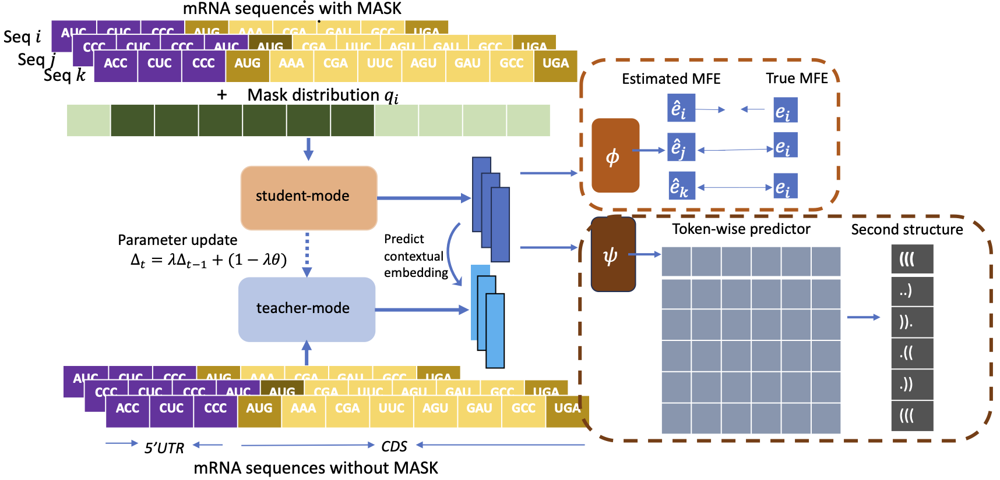

# mRNA2vec
code for mRNA2vec paper
# mRNA2vec
This is the code for the AAAI25 paper mRNA2vec (https://arxiv.org/pdf/2408.09048)


## Pre-training stage 
we collect five species (human, rat, mouse, chicken, and zebrafish) mRNA sequences from the NIH with the datasets API ( https://www.ncbi.nlm.nih.gov/datasets/docs/v2/reference-docs/command-line/datasets/)

The pre-training took approximately 3 hours on four Nvidia GeForce RTX 4090 GPUs.
```bash
torchrun --nproc_per_node=4 pretrain_mrna2vec.py
```

## Downstream task
Using the checkpoint from the pre-training as the encode, we finetune the model on different downstream tasks.
For example, for the HEK dataset Translation Efficiency problem, the task_name = "HEK_TE"
```bash
python sft_exp.py --task_name "HEK_TE" --exp_name "d2v" --data_path "data1" --model_name "model_d2v_mfe0.1_ss0.001_specific.pt" --load_model True --cuda_device "3"
```

## Licensee 
This code is free to use for research purposes, but commercial use requires explicit permission from the author.

If you use this code in your research, please cite our paper:
```
@article{zhang2024mrna2vec,
  title={mRNA2vec: mRNA Embedding with Language Model in the 5'UTR-CDS for mRNA Design},
  author={Zhang, Honggen and Gao, Xiangrui and Zhang, June and Lai, Lipeng},
  journal={arXiv preprint arXiv:2408.09048},
  year={2024}
}


